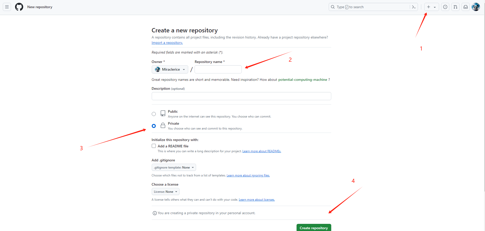
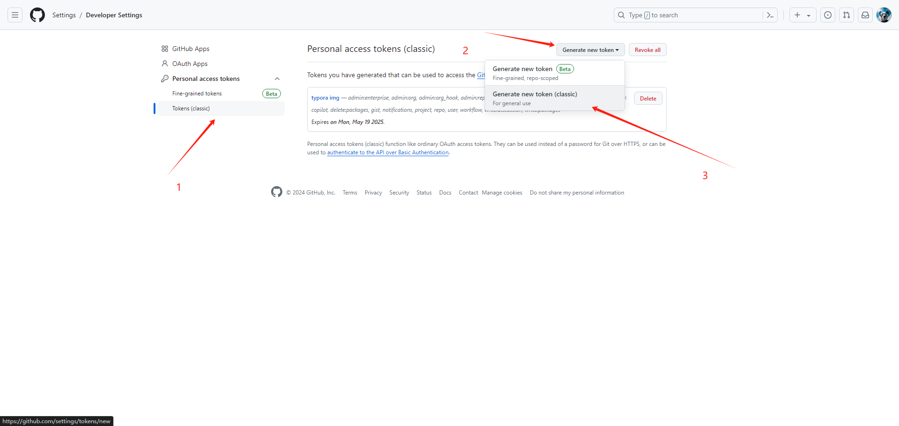
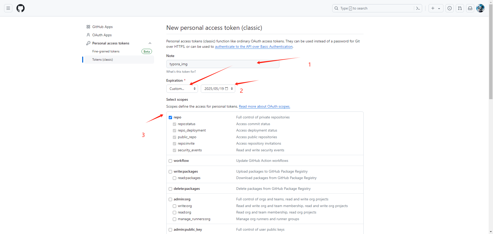
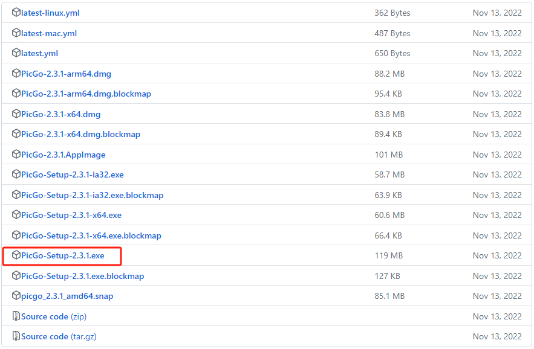
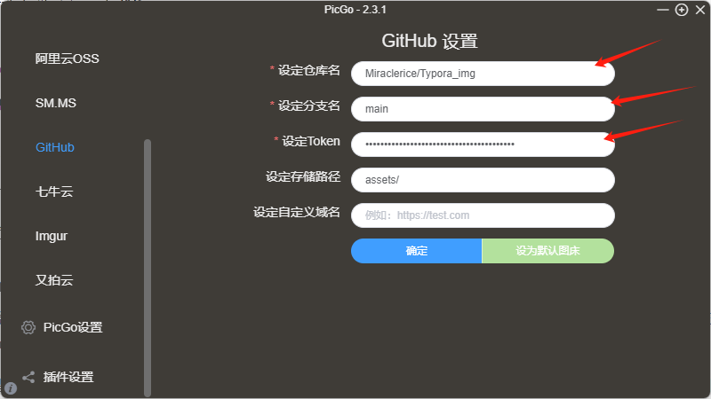
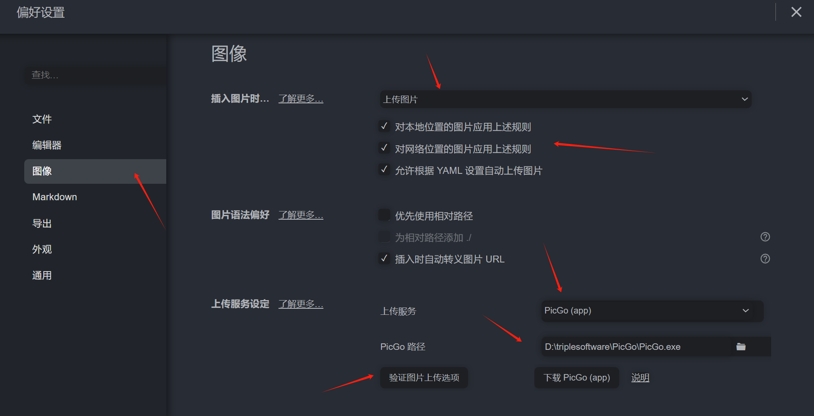

### Github与PicGo搭建图床并实现Typora内复制自动上传

#### 1 在[Github](https://github.com/)网站创建一个新的仓库

仓库名称随意，公开或者私有都行，最后直接创建

#### 2 生成密钥token

点击Github官网，个人头像单击一下，点击`Settings`，找到`Developer settings`，点进去找到`Personal access tokens`下的`Tokens(classic)`，按照下图依次选择`Generate new token (classic)`，最后填写`Note`、有效期和勾选repo，最后一定要记住复制token

#### 3 配置[PicGo](https://picgo.github.io/PicGo-Doc/)

- 下载[PicGo](https://github.com/Molunerfinn/PicGo/releases)

  

- PicGo的Github配置（点击确定后可以随意上传一个图片验证一下）

  

- Typora配置

  
